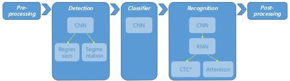
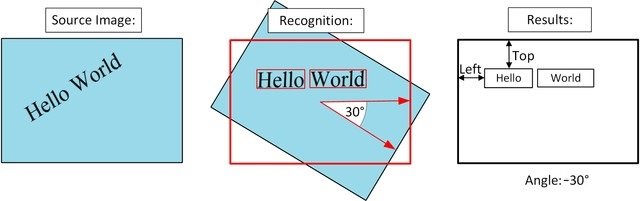
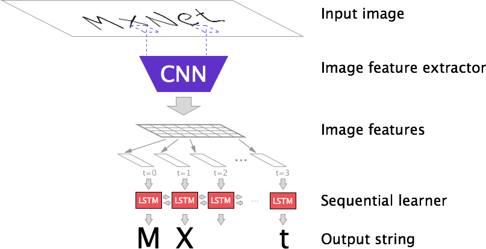

# # OCR (Optical Character Recognition)
- 광학 문자 인식(OCR, Optical Character Recognition)은 사람이 쓰거나 기계로 인쇄한 문자의 영상을 이미지 스캐너로 획득하여 기계가 읽을 수 있는 문자로 변환하는 것

## # OCR 4단계
- 1단계(Pre-processing, 전처리)
- **2단계(Text Detection. 글자탐지)**
- **3단계 (Text Recognition, 글자 인식)**
- 4단계 (Post-processing, 후처리)

## # 1. Pre-processing 단계
- 문서를 디지털로 처리하는 과정에서는 잡음(noise), 왜곡(distort)으로 인해 인식률이 현저하게 낮아지는 경우가 많음. => **전처리 과정을 통한 인식률 개선 가능**
- Grayscale 변환
- 히스토그램 정규화
    - 밝기의 분포를 재분배해 명암 대비를 최대화하여 더 선명한 이미지를 가짐

## # 2. Text Detection 단계
- **이미지에서 텍스트 영역을 골라내어 불필요한 계산을 줄임**
- Convolution을 통한 FeatureMap 추출
- rotation angle regression (회전 문제)

- text인지 text가 아닌지에 대한 segmentation (=classification 이기도 함)
- Detection이 끝나면 TextBox에 대한 ROI들을 출력 및 Crop 작업 진행

### 2-1) three types of detection CNN
- 1) type1 pyramid + multi prediction (ssd 같은)
- 2) pyramid + feature fusion + multi-prediction 
- 3) pyramid + feature fusion + single prediction

## # 3. Text Recognition 단계
- 이미지를 잘라낸 후 각 이미지가 어떤 글자를 포함하고 있는지 인식 필요
- **Convolution layer Model과 Recurrent layer Model로 이루어짐**
- language별로 당연히 모듈 따로 존재 / crop된 textbox를 언어별로 분류 실행 가능

### 3-1) Convolution layer Model
- Convolutional, Normalization연산, maxpool 연산 3가지로 이루어짐
- 2단계와 마찬가지로 CNN이 사용 Shared CNN도 가능함
- CNN 이미지를 Vertical(세로로)로 쪼개며, 글자마다 여러개의 Feature가 나옴
    - 쪼갠 Feature들을 내부적으로 alignment라고도 함.

### 3-2) Recurrent layer Model
- 그러한 alignment들을 sequence를 RNN을 통해 학습
- 글자들이 쪼개진걸 다시 조합하기 위해서 decoder가 존재 
    - decoder를 위해 CTC Loss(Connectionist temporal classification loss)
    - decoder를 위해 Attention도 사용가능

## # 4. Post-processing 단계
- 품질이 낮은 워드들 버리기 
- 워드들을 합쳐 Sentence 생성
- 맞춤법체크 보완 등 (ex. oat -> cat )

## # OCR Paper
- 크게 3종류
    - 1. TextDetection
    - 2. TextRecognition
    - 3. end to end ( 1. + 2. )

### 필수 논문 List
- (2016)TextBoxes: A Fast Text Detector with a Single Deep Neural Network
- (2017)EAST: an Efficient and Accurate Scene Text Detector)
- (2017)AON: Towards Arbitrarily-Oriented Text Recognition
- (2018)FOTS: Fast Oriented Text Spotting with a Unified Network
- (2018)Multi-Oriented Scene Text Detection via Corner Localization and Region Segmentation
- (2018)Geometry-Aware Scene Text Detection with instance Transformation Network
- (2018)An end-to-end TextSpotter with Explicit Alignment and Attention
- (2018)DocUNet: Document Image Unwarping via A Stacked U-Net
- (2018)ASTER-An Attentional Scene Text Recognizer with Flexible Rectification
- (2019)CRAFT: Character Region Awareness for Text Detection
- (2019)What Is Wrong With Scene Text Recognition Model Comparisons? Dataset and Model Analysis(사진 내 문자 인식 분야의 모델 비교시의 문제는 무엇인가?, 데이터셋 및 모델 분석, 네이버 Clova - ICCV 2019 Oral)

### What Is Wrong With Scene Text Recognition Model Comparisons? Dataset and Model Analysis
- 변환, 특성추출, 시퀀스, 예측 4개모듈로 구분
- 변환 모듈은 TPS(Thin Plate Spline) 사용여부 (2)
- 특성추출 모듈은 VGGNet, RCNN, ResNet (3)
- 시퀀스 모듈은 BiLSTM 사용여부에 따라 (2)
- 예측 모듈은 CTC(Connectionist Temporal Classification) 과 어텐션으로 구성 (2)

- **따라서 4개 모듈조합은 전체 경우의 수가 2 x 3 x 2 x 2 = 24가지**로 모든 조합에 대한 실험을 진행
- 논문에서 최고 정확도의 모델조합은 TPS-ResNet-BiLSTM-Attn (영문 단어기준 84%)
- 한글문장 데이터로 실험한 결과 TPS-VGG-BiLSTM-Attn 으로 88.24% 의 정확도가 나왔다(박선우 님)

## # OCR 컴피티션
- 국제패턴인식 협회인 IAPR 주관의 국제 컴퓨터 문자인식 대회인 ICDAR 로버스트 리딩 컴피티션(ICDAR Robust Reading Competition) 챌린지

## # OCR 국산 오픈소스 OCR 
### Tesseract
- Source Repository: https://github.com/tesseract-ocr/tesseract
- 상대적으로 유구한 역사를 가진 Open Source OCR 툴 
- HP에서 개발을 시작해서 Open Source화 한 이후 Google의 개발자들이 유지보수
- C기반 개발 및 여러 wrapper library들도 풍부하게 존재 / 다양한 option 제공됨
- 국문 폰트 3~4가지 정도로만 학습되었기 때문에 다양한 폰트로 추가 학습시 성능향상 기대

- 단점
    - 속도가 느린편
    - GPU 지원이 안됨

### EasyOCR
- Source Repository: https://github.com/JaidedAI/EasyOCR
- Tesseract보다 정확도 면에서도 향상
- GPU 연산을 지원하기 때문에 성능(속도)면에서도 개선
- 아파치 2.0으로 상용에도 이용 가능
- 추가학습 용이 및 추가폰트 학습 가능
- Naver에서 만들어 공개한 CRAFT라는 TextDetection 도구 이용

### ocr_kor
- Source Repository: https://github.com/parksunwoo/ocr_kor
- 박선우, Naver에서 연구하여 공개한 Deep-text-recognition-benchmark를 한국어로 학습시킨 OCR 툴
- Text Detection 부분이 없기 때문에 일반 문서의 OCR은 수행하지 못함
- 학습 데이터 생성기를 제공하는 등 추가 학습이 가능한 형태

## # OCR 국내 트렌드

- 삼성 SDS (AICR, Nexfinance AICR) 
    - 딥러닝 기반의 OCR 솔루션 삼성 넥스 파이낸스 (AICR) 
    - 자체 개발한 AI기반 OCR 기술로 외부환경 요인 노이즈를 제거, 원본 영상의 문서 특징을 강화한 것이 특징
    - 저조도, 워터마크, 구겨진 이미지, 기울어짐 및 원근 등을 최적화해 정확하게 인식
    - 외환 수출입 심사 자동화, 기업 재무제표, 보험금 청구 자동화, 기업 소송자료 디지털 자산화 등 복잡한 업무처리에 활용될 전망
    
    
- **네이버 클로버 OCR**
    - 네이버 클라우드 플랫폼 기반 OCR 서비스 공급 계약 체결
    - 다양한 언어 지원 및 문서별로 최적화된 모델제공
    - 네이버 OCR 기술은 단어가 아닌 글자를 하나씩 인식한 후 이를 합치는 방식을 채택
    - 특정 이미지의 글자 크기와 자간 등을 계산하는 기술을 개발
    - **OCR분야 가장 권위있는 글로벌 챌린지ICDAR2019 4개 분야에서 1위**
    
- 신세계 SSG 닷컴
    - 이미지 상품 검색 서비스 (쓱렌즈)에 OCR 기술 적용
    - 일일이 입력하기 까다로운 상품 모델번호나 브랜드명의 사진을 통해 텍스트 추출, 검색 가능

- 카카오 OCR
    - 사물 탐지모델 (YOLO)와 비슷한 구조를 가진 EAST(Efficient and accurate scene text detector) 기반 유사 모델
    

    
## # 활용분야

### RPA & OCR
- OCR 프로세스의 자동화(효율화) 측면 - RPA(Robotic Process Automation)

### RealTime & OCR

## # 참고문헌
- http://jaynewho.com/post/6 // textbox 가장 기본.
- https://medium.com/@msmapark2/character-region-awareness-for-text-detection-craft-paper-%EB%B6%84%EC%84%9D-da987b32609c // craft 논문 리뷰
- https://www.kakaobrain.com/blog/50 // OCR기초 4단계 설명
- https://github.com/Belval/TextRecognitionDataGenerator // python trdg 공식 git
- https://github.com/tangzhenyu/Scene-Text-Understanding // ocr 관련 논문 list
- https://github.com/tesseract-ocr // tesseract-ocr
- https://theonly1.tistory.com/2291 // craft 기반 ocr 프로그램
- https://velog.io/@vanang7/%EA%B5%AD%EB%AC%B8-%EC%98%A4%ED%94%88%EC%86%8C%EC%8A%A4-OCR // 국산 ocr 비교
- https://brunch.co.kr/@kakao-it/318
- https://www.2e.co.kr/news/articleView.html?idxno=203023
- https://www.ncloud.com/product/aiService/ocr 
- http://m.ddaily.co.kr/m/m_article/?no=187628 // 네이버 클로버 ICCV 2019 OCR Paper 뉴스기사

