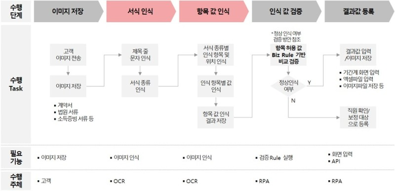
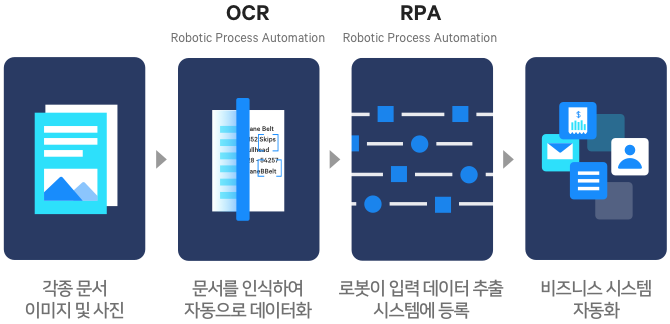

# # OCR (Optical Character Recognition)
- 광학 문자 인식(OCR, Optical Character Recognition)은 사람이 쓰거나 기계로 인쇄한 문자의 영상을 이미지 스캐너로 획득하여 기계가 읽을 수 있는 문자로 변환하는 것

- **글자 영역 탐지(text detection)** 와 **글자 인식(text recogniton)**의 두 단계 과정을 거침

## # 글자 탐지 모델 (Text Detection Model)
- 사물 탐지 모델
    - RCNN(Region with convolutional neural network) 계열
        - region proposal을 거치는 모델
        - 더 나은 정확도를 보이지만 시간당 처리 이미지의 수가 적다
    - Single shot detecot 계열
        - SSD(single-shot multibox detector), YOLO(you only look once) 계열
    - 속도와 정확도 중 어느쪽에 더 비중을 두는지에 따라 구조적으로 큰 차이를 가짐

- Text Localization (글자위치찾기)
    -  EAST(an Efficient and Accurate Scene Text Detector)
    
## # 글자 인식 모델 (Text Recognition Model)
- 글자 인식 모델
    - Convolution layer Model과 Recurrent layer Model로 이루어짐.
    - Loss는 CTC loss (Connectionist temporal classification loss) 사용

- Convolutional layer
    - Convolutional, Normalization연산, maxpool 연산 3가지로 이루어짐
    - 글자 예측을 위해 필요한 필터들 학습
    - 
    
## # OCR Paper
- What Is Wrong With Scene Text Recognition Model Comparisons? Dataset and Model Analysis(사진 내 문자 인식 분야의 모델 비교시의 문제는 무엇인가?, 데이터셋 및 모델 분석) // 네이버 Clova - ICCV 2019 Oral

## # OCR 오픈소스
- 인식 처리 속도와 사물의 경계선을 이해할 수 있는 Contours 추출
- Text Detection Model 부분의 17년 4월에 공개된 EAST(an Efficient and Accurate Scene Text Detector) : OpenCV 기반 딥러닝 파이프라인을 새로운 방식으로 개선
- Text Recognition Model : Tesseract (테서렉트) 

- 구글클라우드 Vision API / 마이크로소프트 컴퓨터 비전(Microsoft Computer Vision)
    - https://cloud.google.com/vision/docs/pdf?hl=ko // 구글 클라우드 Vision API 손글씨체 or PDF 리딩 REST API 통해서 받을수 있음.
    
    
## # OCR 컴피티션
- 국제패턴인식 협회인 IAPR 주관의 국제 컴퓨터 문자인식 대회인 ICDAR 로버스트 리딩 컴피티션(ICDAR Robust Reading Competition) 챌린지

## # 활용분야

### RPA & OCR
- OCR 프로세스의 자동화(효율화) 측면 - RPA(Robotic Process Automation)

### RealTime & OCR

## OCR 국내기업 트렌드

- 삼성 SDS (AICR, Nexfinance AICR) 
    - 딥러닝 기반의 OCR 솔루션 삼성 넥스 파이낸스 (AICR) 
    - 자체 개발한 AI기반 OCR 기술로 외부환경 요인 노이즈를 제거, 원본 영상의 문서 특징을 강화한 것이 특징
    - 저조도, 워터마크, 구겨진 이미지, 기울어짐 및 원근 등을 최적화해 정확하게 인식
    - 외환 수출입 심사 자동화, 기업 재무제표, 보험금 청구 자동화, 기업 소송자료 디지털 자산화 등 복잡한 업무처리에 활용될 전망
    
    
- **네이버 클로버 OCR**
    - 네이버 클라우드 플랫폼 기반 OCR 서비스 공급 계약 체결
    - 다양한 언어 지원 및 문서별로 최적화된 모델제공
    - 네이버 OCR 기술은 단어가 아닌 글자를 하나씩 인식한 후 이를 합치는 방식을 채택
    - 특정 이미지의 글자 크기와 자간 등을 계산하는 기술을 개발
    - **OCR분야 가장 권위있는 글로벌 챌린지ICDAR2019 4개 분야에서 1위**
    
- 신세계 SSG 닷컴
    - 이미지 상품 검색 서비스 (쓱렌즈)에 OCR 기술 적용
    - 일일이 입력하기 까다로운 상품 모델번호나 브랜드명의 사진을 통해 텍스트 추출, 검색 가능

- 카카오 OCR
    - 사물 탐지모델 (YOLO)와 비슷한 구조를 가진 EAST(Efficient and accurate scene text detector) 기반 유사 모델
    
## 참고문헌
- https://brunch.co.kr/@kakao-it/318
- https://www.2e.co.kr/news/articleView.html?idxno=203023
- https://www.ncloud.com/product/aiService/ocr 
- http://m.ddaily.co.kr/m/m_article/?no=187628 // 네이버 클로버 ICCV 2019 OCR Paper 뉴스기사